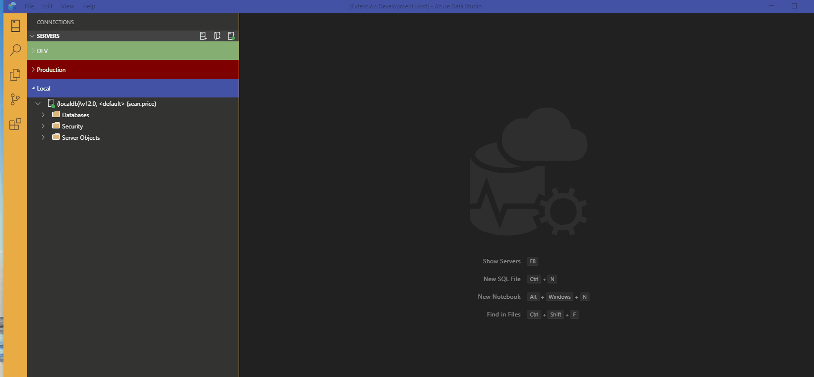

# Azure Data Studio - Simple Data Scripter 

This extension provides a quick and easy way to migrate data between tables by generating insert scripts based on the result sets of a query. It defaults to generating all data from a given table (based on the table selected via a context menu), but the default sql can be modifed to generate subsets of data. 

## Installation
The current release is available to [download as a .vsix file](https://github.com/ecirpnaes/SimpleDataScripter/releases/download/0.1.0/simple-data-scripter-0.1.0.vsix) and can be installed by opening the File Menu and selecting `Install Extension from VSIX Package` 

## Features

Right-click on a table node to bring up a [`Script Table Data`] context menu.

-----------------------------------------------------------------------------------------------------------
## Known Issues

- This has only been tested with the MSSQL provider, i.e. Microsoft SQL Server. If there are any issues found with other flavors of SQL, (MySql, etc..) please report them at https://github.com/ecirpnaes/simple-data-scripter/issues
- Scripting of binary data (binary, varbinary, image) is not currently supported. 

## Unknown Issues

Can be raised here: https://github.com/ecirpnaes/simple-data-scripter/issues

## Release Notes

### 0.1.0

- Initial release.